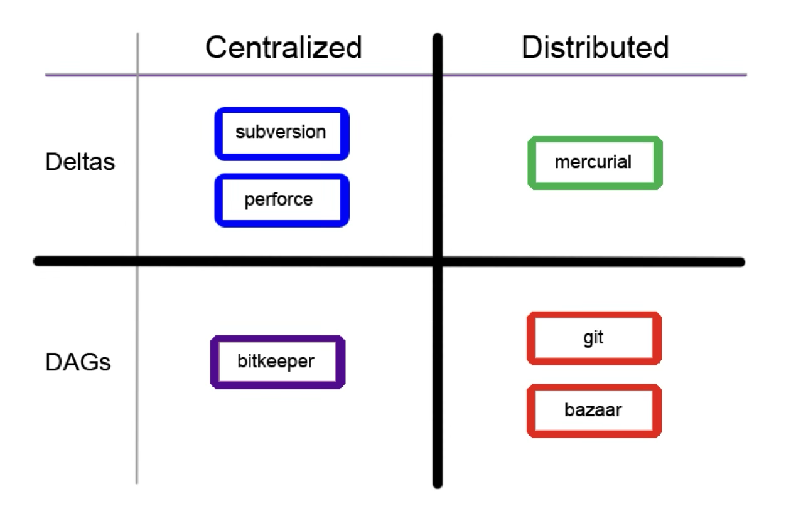
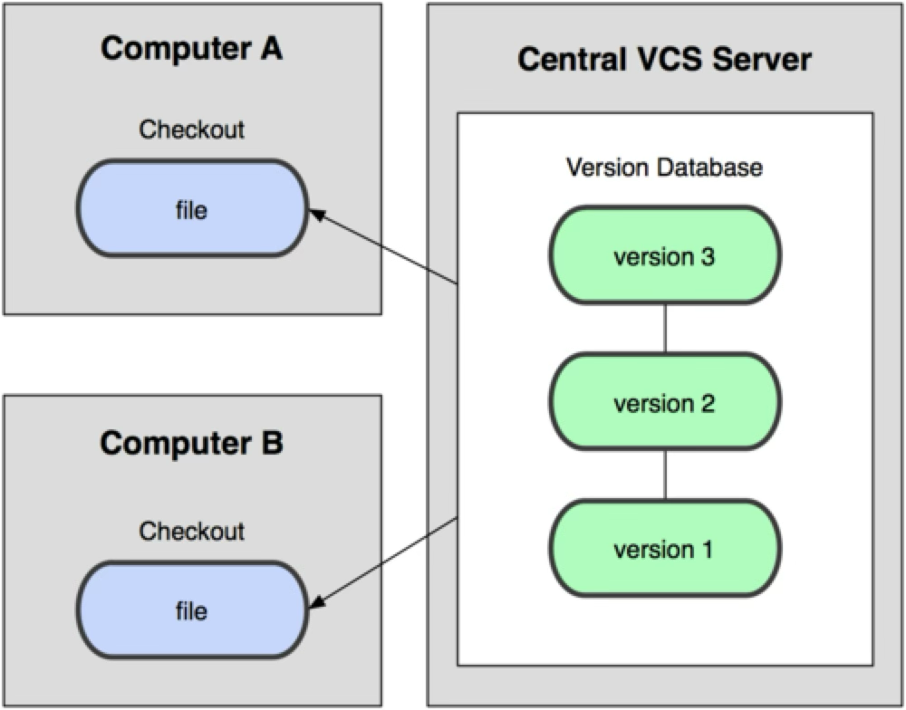
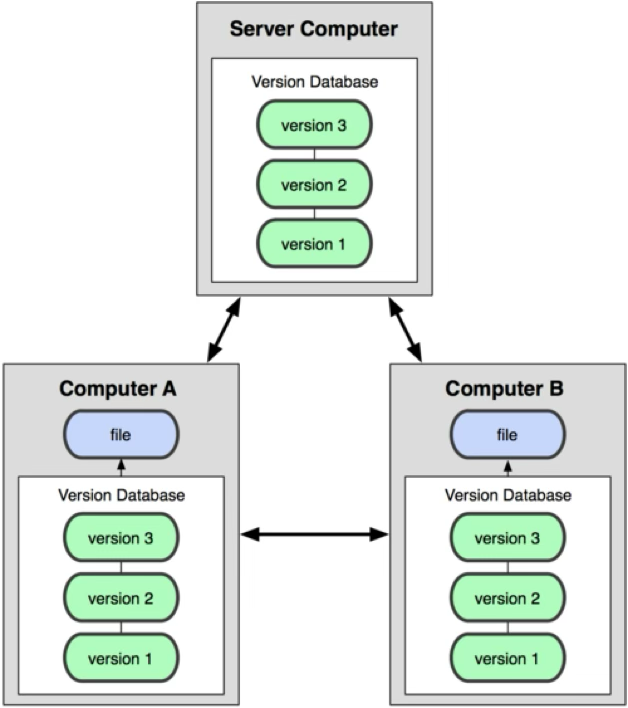

# ประวัติและความเป็นมา และวิธีคิดในการจัดการ Souce code ด้วย Git

## 1. History

> [https://github.blog/open-source/git/git-turns-20-a-qa-with-linus-torvalds/](https://github.blog/open-source/git/git-turns-20-a-qa-with-linus-torvalds/)

---

## 2. Version Control Systems

### Version Control Systems

---

### Centralized Version Control

---

### Distributed Version Control

---

## 3. Git Concepts and Architecture

1. Speed
2. Simple design
3. Support for many parallet branches
4. Fully distributed
5. To handle large project like Linux kernel

---

[home](../../README.md#) | [current](../../README.md#1-ประวัติและความเป็นมา-และวิธีคิดในการจัดการ-souce-code-ด้วย-git) | [next](../../README.md#2-การจัดการและบริหาร-source-code-เบื้องต้น-ส่วนที่-1)
