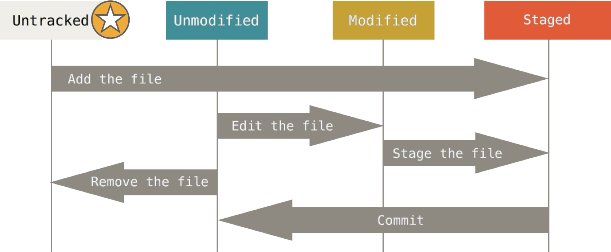
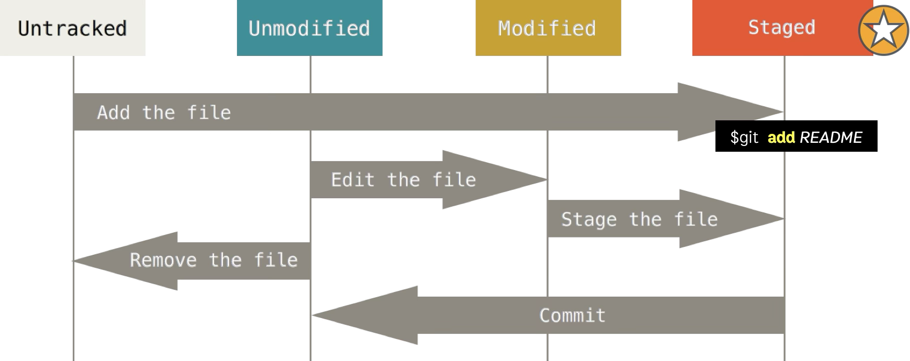
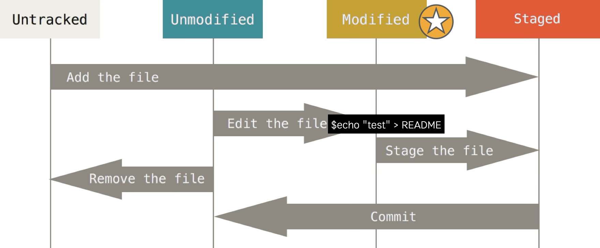
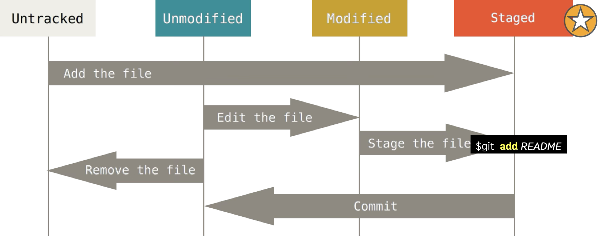
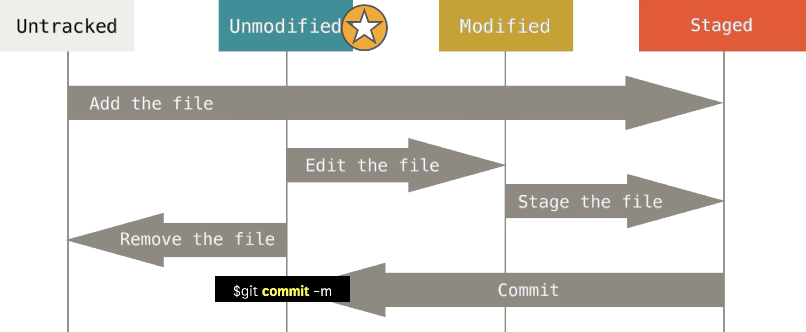
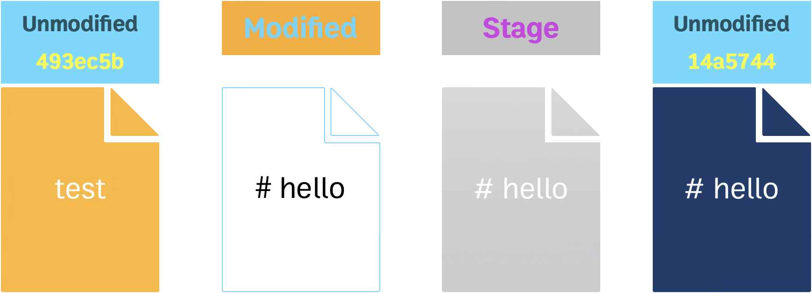
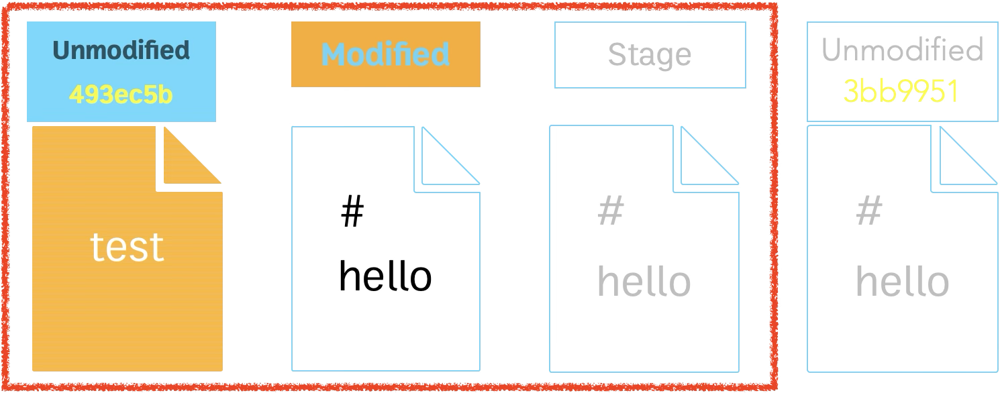
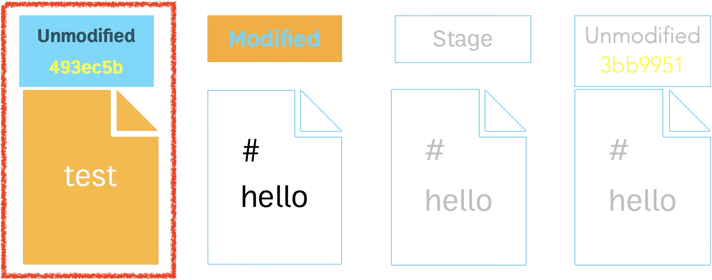

# 2. การจัดการและบริหาร Source Code เบื้องต้น ส่วนที่ 1

## 1. Life cycle ของ Git


---

## 2. Basic Commands ที่ใช้ประจำ

```sh
git init
git clone
git status
git status --short
git diff
git add
git commit
git commit -m "Commit message"
git log
git log --oneline
git log --oneline --graph
git log --stat
git mv
git rm
```

### git reset: --soft, --mixed, --hard

```sh
git reset --soft
git reset --mixed
git reset --hard
```

---

## 3. Setup git

### 1. git config

```sh
git config list
git config list --global
git config list --local
```

### 2. pull.rebase=false

1. local

   ```sh
   git config set --local pull.rebase false
   git config set pull.rebase false
   git config unset --local pull.rebase
   git config unset pull.rebase
   ```

2. global

   ```sh
   git config set --global pull.rebase false
   git config unset --global pull.rebase
   ```

### 3. core.ignorecase=false

1. local

   ```sh
   git config set --local core.ignorecase false
   git config set core.ignorecase false
   git config unset --local core.ignorecase
   git config unset core.ignorecase
   ```

2. global

   ```sh
   git config set --global core.ignorecase false
   git config unset --global core.ignorecase
   ```

---

## 4. gitignore

```.gitignore
# dotenv files
.env

# Build results
[Dd]ebug/
[Dd]ebugPublic/
[Rr]elease/
[Rr]eleases/
x64/
x86/
[Ww][Ii][Nn]32/
[Aa][Rr][Mm]/
[Aa][Rr][Mm]64/
bld/
[Bb]in/
[Oo]bj/
[Ll]og/
[Ll]ogs/
```

> [https://github.com/github/gitignore](https://github.com/github/gitignore)

---

## 5. getting help

1. git help <verb>
2. git <verb> help
3. man git-verb

---

## 6. In Action

1. Initial repository

   ```sh
   mkdir git-workspace
   cd git-workspace
   git init
   ```

   

2. Create a file

   ```sh
   touch README
   git status
   ```

   

3. Add a file

   ```sh
   git add README
   git status
   ```

   

4. Commit changes

   ```sh
   git commit -m “Add README”
   ```

   

5. Modify files

   ```sh
   echo “test” > README
   git status
   ```

   

6. Add a file

   ```sh
   git add README
   git status
   ```

   

7. Commit changes

   ```sh
   git commit -m “Edit README”
   git status
   ```

   

8. Ignore files and folders

   ```sh
   touch note
   mkdir tmp
   touch tmp/file
   git status
   touch .gitignore
   echo "note" > .gitignore
   echo "tmp/" >> .gitignore
   ```

9. Git reset

   ```sh
   echo "# hello" > README
   git add README
   git commit -m "Edit README content"
   git status
   ```

   

   ```sh
   git log
   git log --oneline
   git log --oneline --graph
   git log --stat
   ```

   - git reset --soft [Commit ID]

     

   - git reset --mixed [Commit ID]

     

   - git reset --hard [Commit ID]

     

---

[home](../../README.md#) | [current](../../README.md#2-การจัดการและบริหาร-source-code-เบื้องต้น-ส่วนที่-1) | [next](../../README.md#3-การจัดการและบริหาร-source-code-เบื้องต้น-ส่วนที่-2)
