# 3. การจัดการและบริหาร Source Code เบื้องต้น ส่วนที่ 2

## 1. วิธีคิดและวัตถุประสงค์ของการใช้งาน Branch

1. แยกการทำงาน (Isolation)

   - แต่ละ branch สามารถแยกการทำงานออกจากกัน เช่น การพัฒนา feature ใหม่, แก้ bug, ทดสอบโค้ด หรือ refactor
   - ช่วยให้โค้ดใน branch หลัก (เช่น main) ไม่ถูกรบกวนจากการพัฒนาอื่น

2. ทำงานร่วมกันแบบขนาน (Parallel Development)

   - นักพัฒนาหลายคนสามารถพัฒนา feature คนละสาขาได้พร้อมกัน โดยไม่ชนกัน
   - ลดปัญหา merge conflict และช่วยให้ทีมทำงานได้รวดเร็วขึ้น

---

## 2. การใช้งาน Branch

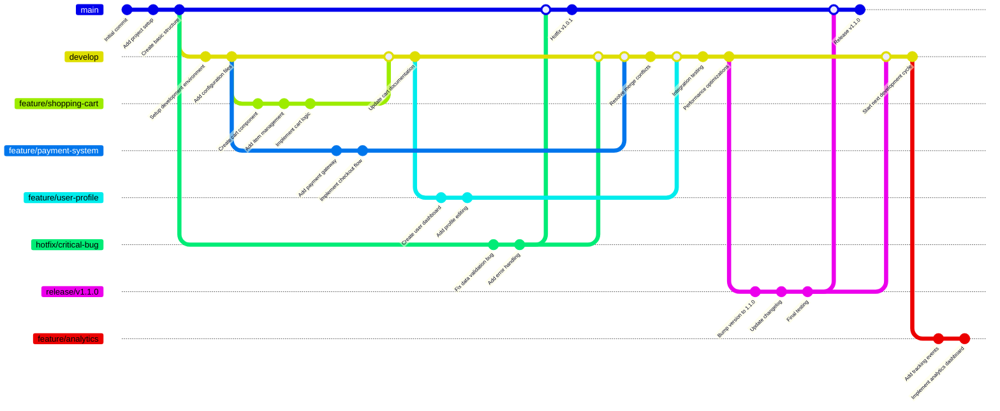

- การสร้าง branch

  ```sh
  git branch <branch-name>
  ```

- การลบ branch

  ```sh
  git branch -D <branch-name>
  git branch --delete branch-name
  ```

- การสลับ branch

  ```sh
  git-switch <branch-name>
  ```

- การสร้างและสลับ branch

  ```sh
  git-switch -c <branch-name>
  ```

---

## 3. การ merge branch

### git merge

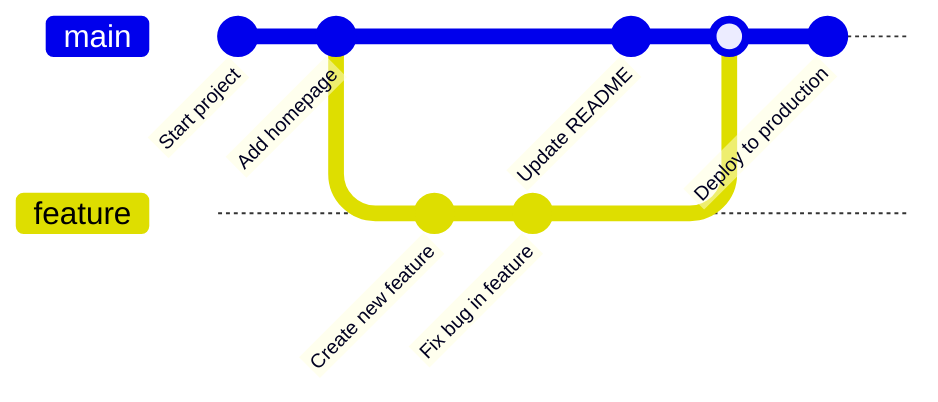

```sh
git merge <branch>
```

### git rebase

#### Before Rebase

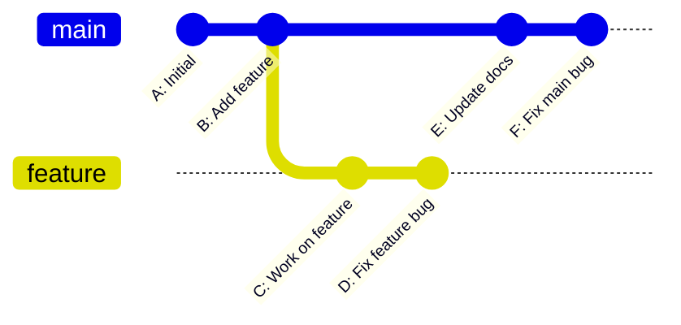

#### After Rebase

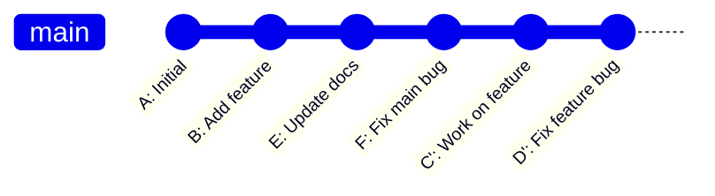

```sh
git rebase <branch name>
```

---

## 4. การใช้งาน Tags

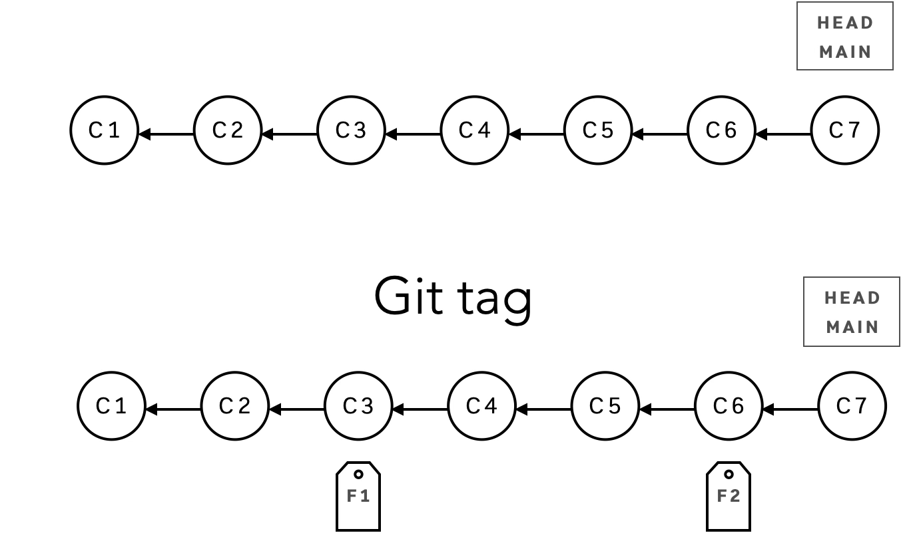

```sh
git tag
git tag -l
```

```sh
git tag
git tag -a <tagname> -m <message>
git tag -a <tagname> <commit ID>
```

```sh
git tag -d <tagname>
```

```sh
git show <tagname>
```

```sh
git push <remote branch> <tagname>
git push <remote branch> --tags
```

```sh
git push origin --delete <tagname>
```

```sh
git checkout <tagname>
```

---

## 5. commands อื่นๆ

[image]

- git revert
- git filter

---

## 6. In Action

1. Check current branch

   ```sh
   git branch
   ```

   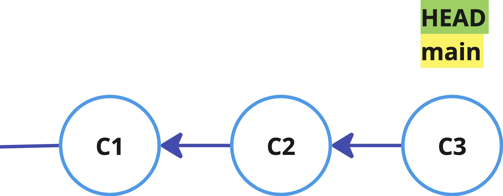

2. Create new branch

   ```sh
   git branch dev
   ```

   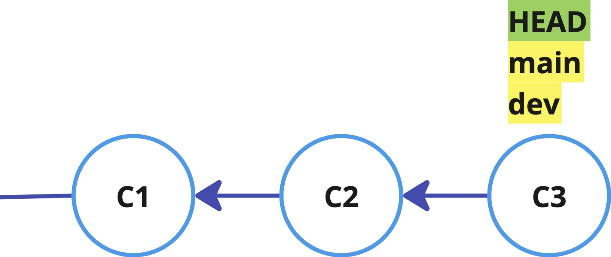

3. Switch branch

   ```sh
   git switch dev
   ```

   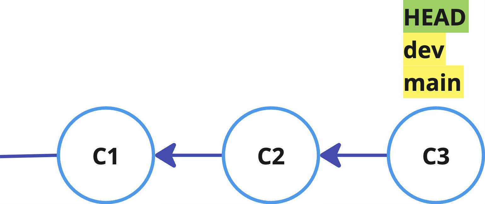

4. Modify and Commit on `dev`

   ```sh
   echo “On branch dev” > README
   git commit -am “Add new content on branch dev”
   ```

   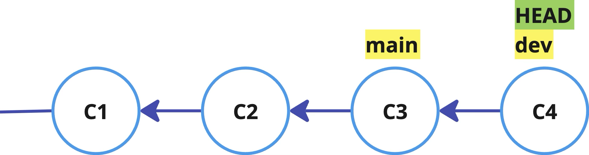

5. Switch to `main`

   ```sh
   git switch main
   ```

   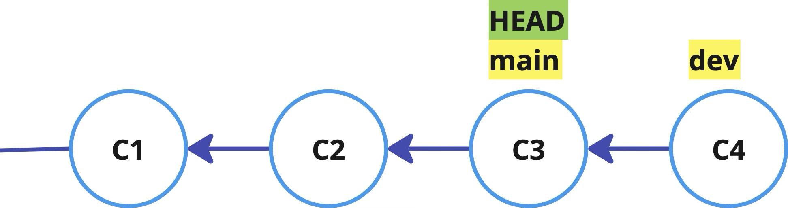

6. Modified and commit on `main`

   ```sh
   echo “On branch main” >> README
   git commit -am “Add new content on branch main”
   ```

   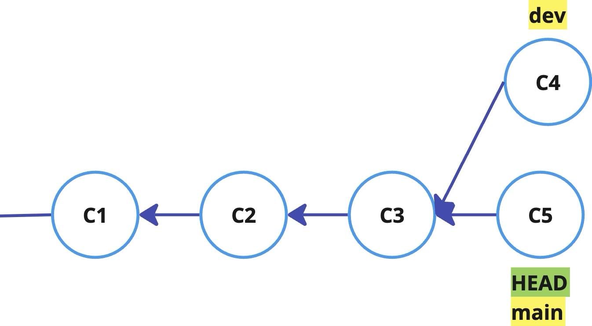

7. Switch to `dev`

   ```sh
   git switch dev
   ```

8. Merge branch `main` to `dev`

   ```sh
   git merge main
   ```

   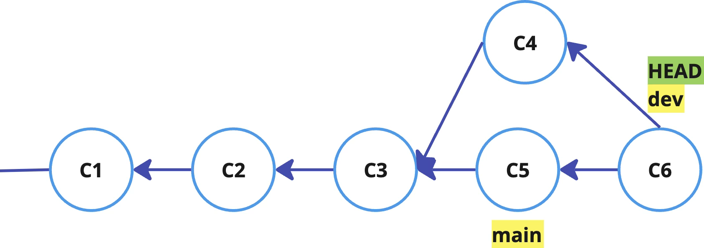
   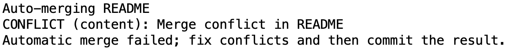

9. Check status

   ```sh
   git status
   ```

   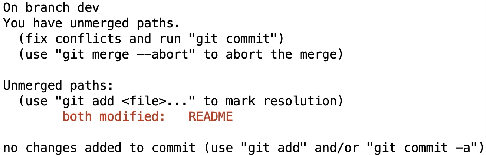

10. Conflict

    ```sh
    cat README
    ```

    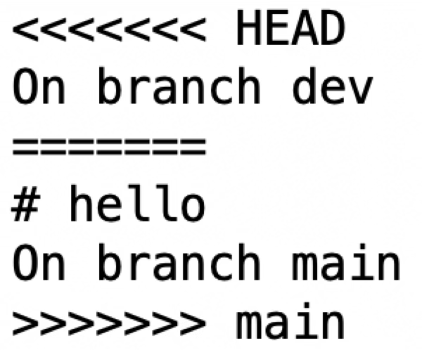

11. Fix Conflict

    ```sh
    git status
    git add README
    git commit
    ```

12. Switch to main

    ```sh
    git switch main
    ```

13. Merge branch `dev` to `master`

    ```sh
    git merge dev
    ```

    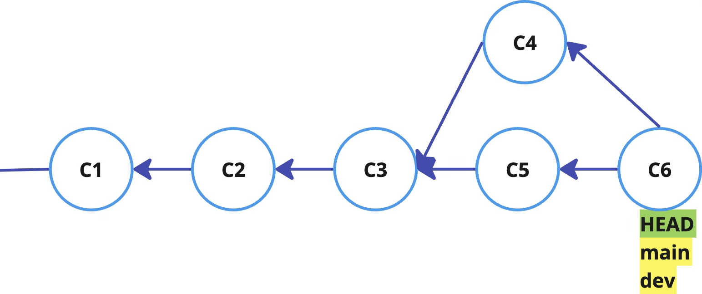

---

## 7. Avoid Merge Conflict

1. Small change and commit
2. Early merge
3. Single Responsibility Principle
4. Communication is a Key
5. Mob programming

---

## 8. Rebase

1. Log and copy commit id

   ```sh
   git log --oneline --graph --all
   ```

   - copy dev commit ID(before merge)
   - copy main commit ID(before merge)

2. Reset to before merge: `dev`, `main`

   ```sh
   # main
   git switch main
   git reset --hard <commit ID>

   # dev
   git switch dev
   git reset --hard <commit ID>
   ```

   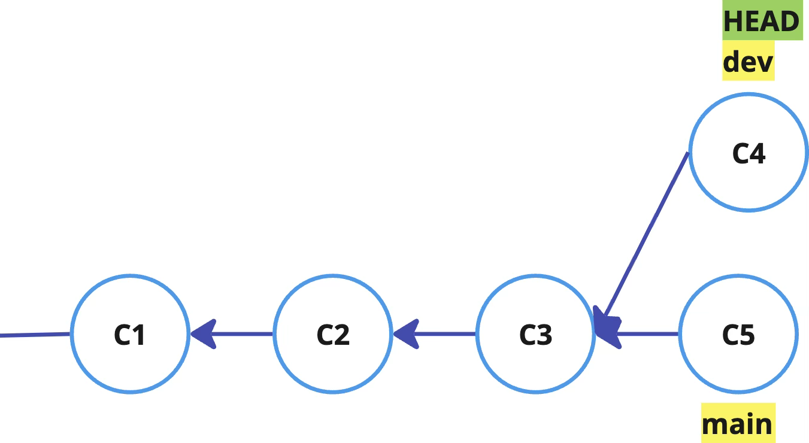

3. Rebase

   ```sh
   git switch dev
   git rebase main
   ```

   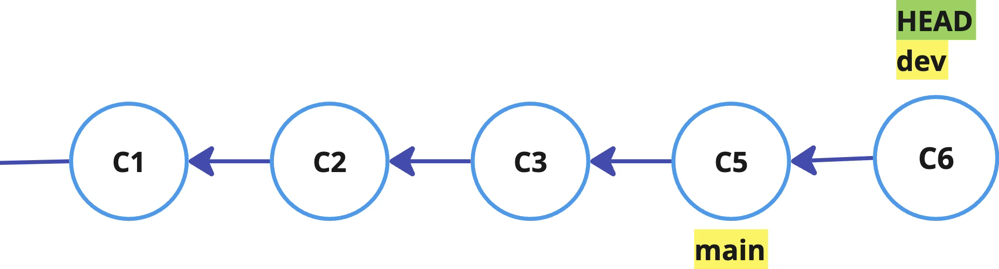

   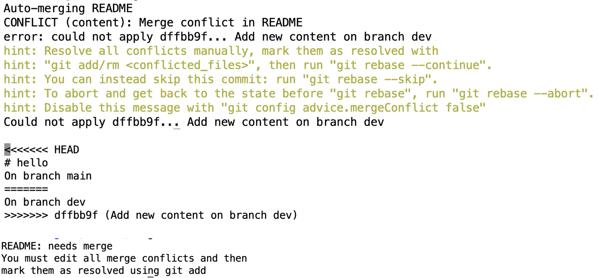

---

[home](../../README.md#) | [current](../../README.md#3-การจัดการและบริหาร-source-code-เบื้องต้น-ส่วนที่-2) | [next](../../README.md#4-การจัดการและบริหาร-source-code-โดยใช้การแชร์ผ่านเครื่อง-remote-server-ส่วนที่-1)
