# 4. การจัดการและบริหาร Source Code โดยใช้การแชร์ผ่านเครื่อง Remote Server ส่วนที่ 1

## 1. Workflow เบื้องต้นในการแชร์ Source code ผ่าน Git

1. เริ่มต้นด้วย Git Repository:

   - สร้างหรือคลอน (clone) remote repository มาที่เครื่อง
   - หรือ สร้าง local repository และเชื่อมต่อกับ remote repository ภายหลัง

2. การพัฒนาและแก้ไข Code:

   - แก้ไขไฟล์ใน local
   - ใช้ git add และ git commit เพื่อบันทึกการเปลี่ยนแปลง

3. ซิงค์การเปลี่ยนแปลง:

   - ใช้ git push เพื่ออัปโหลดไปยัง remote
   - ใช้ git pull หรือ git fetch เพื่อดึงข้อมูลจาก remote

## 2. Commands ที่ใช้ประจำ

### git clone

- http

  ```sh
  git clone https://github.com/<account name>/<repository name>.git
  ```

- git

  ```sh
  git clone git@github.com:<account name>/<repository name>.git
  ```

### git remote: add, remove

- add

  ```sh
  git remote add <name> <repository-url>
  git remote add origin git@github.com:<account name>/<repository name>.git
  ```

- remove

  ```sh
  git remote remove <name>
  ```

### git-push:

- Share code to remote

  ```sh
  git push origin branch-name
  git push -u origin branch-name
  git push
  ```

- Share local branch to remote

  ```sh
  git push origin branch-name
  ```

- Remove branch from remote

  ```sh
  git push origin :branch-name
  git push origin -d branch-name
  ```

### git-pull: fetch, merge

- Pull code from remote

  ```sh
  git pull [<repository> [<refspec>…]]
  git pull
  ```

- Pull code from remote with rebase

  ```sh
  git pull --rebase
  ```

### git-tag

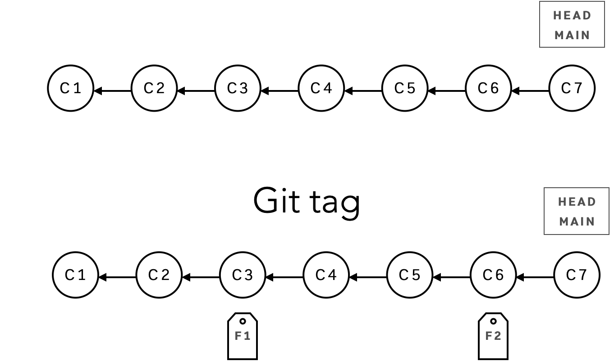

- List tag

  ```sh
  git tag
  git tag -l
  ```

- Create tag

  ```sh
  git tag
  git tag -a <tagname> -m <message>
  git tag -a <tagname> <commit ID>
  ```

- Delete tag

  ```sh
  git tag -d <tagname>
  ```

- Show tag

  ```sh
  git show <tagname>
  ```

- Share tag to remote

  ```sh
  git push <remote branch> <tagname>
  git push <remote branch> --tags
  ```

- Delete tag to remote

  ```sh
  git push origin --delete <tagname>
  ```

- Checkout to tag

  ```sh
  git checkout <tagname>
  ```

- Fetch tags from remote

  ```sh
  git fetch --all --tags
  ```

---

## In Action

### Working with existing remote repository

1. Clone remote repository

   ```sh
   git clone https://github.com/<account name>/<repository name>.git
   ```

   ```sh
   git clone git@github.com:<account name>/<repository name>.git
   ```

   - Before clone

     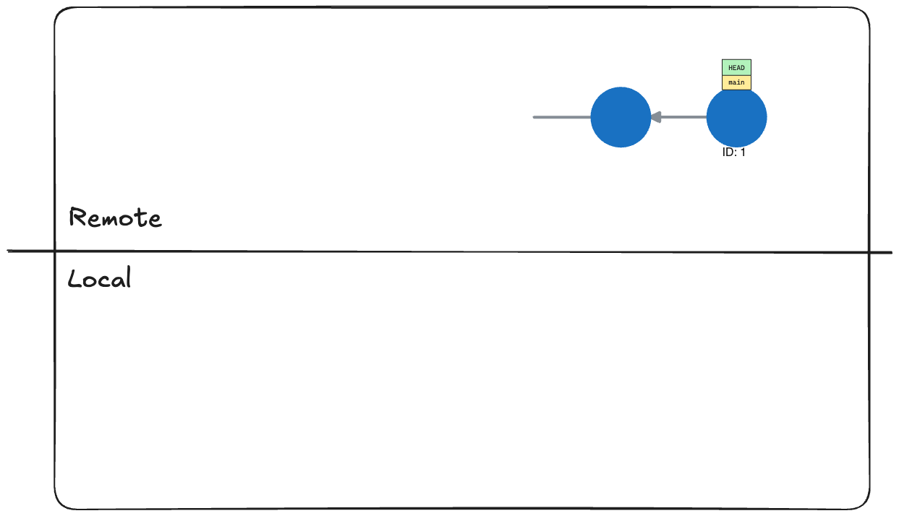

   - After clone

     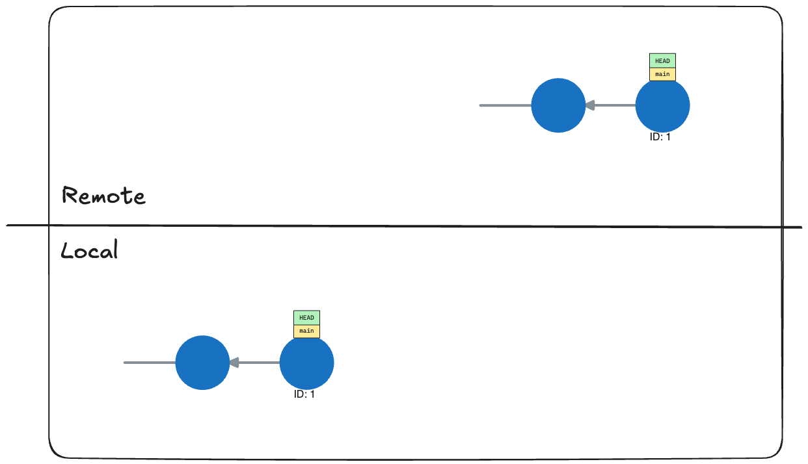

2. Add, Delete, and Update source code
3. Push & Pull remote repository

### Working with existing repository

1. Create remote repository
2. Add remote repository, then push

   ```sh
   git remote add origin git@github.com:<account name>/<repository name>.git
   ```

   - Before Add and Push

     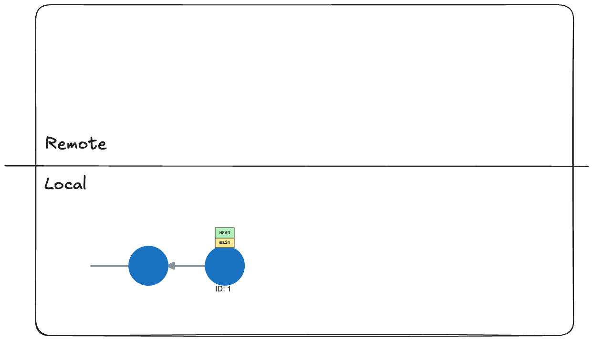

   - After Push

     

3. Add, Delete, and Update source code
4. Push & Pull with remote repository

### Workflow

1. Remote and local repository in sync

   

2. Local has changed

   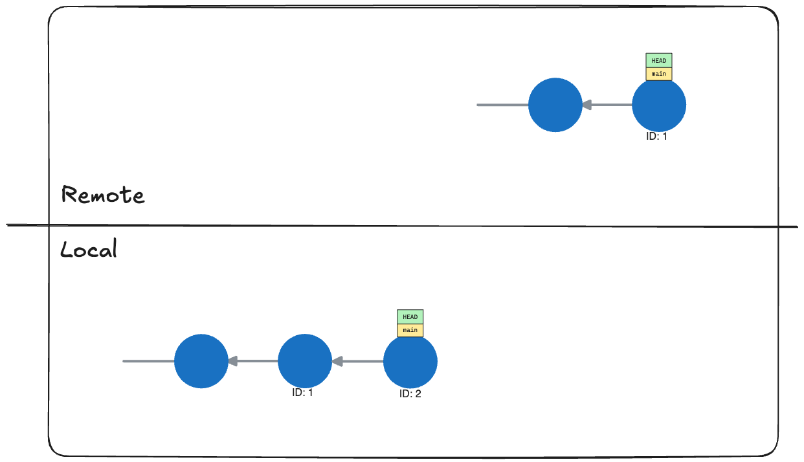

3. Push changes to remote

   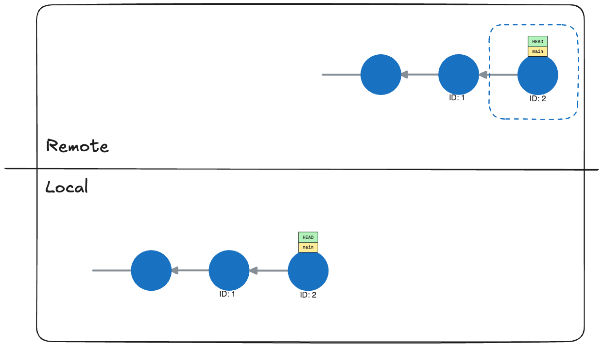

4. Remote has been updated

   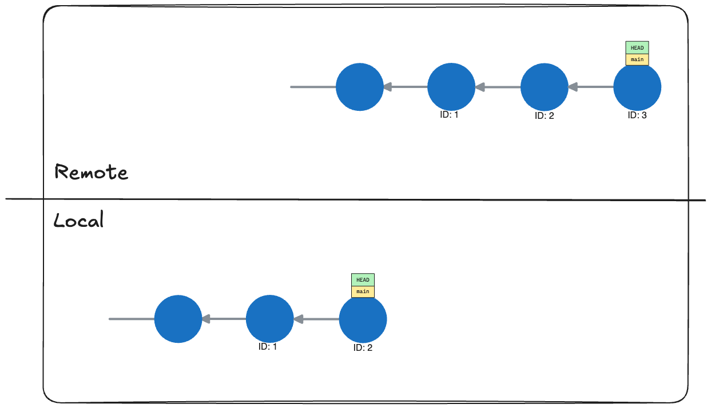

5. Local pull the changes

   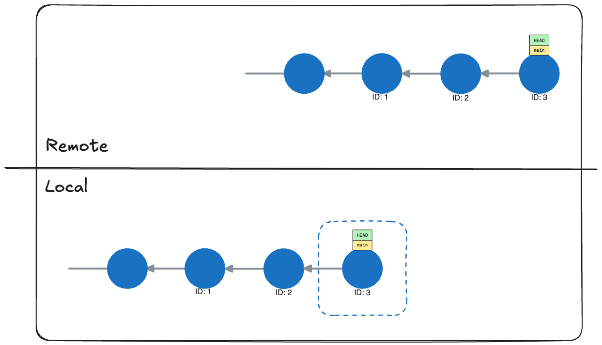

6. Remote and local have changed

   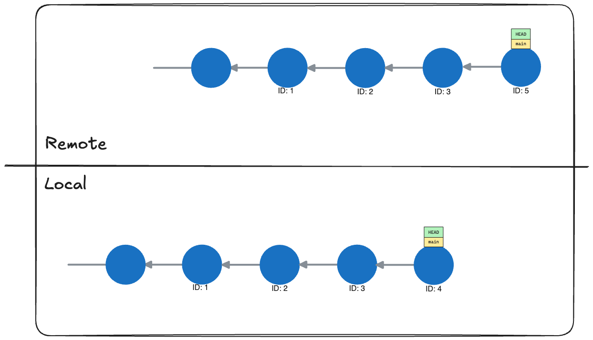

7. Local pull the changes and solve conflict

   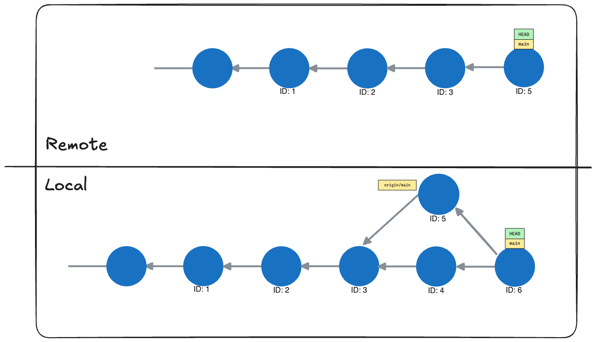

8. Push the update to Remote repository

   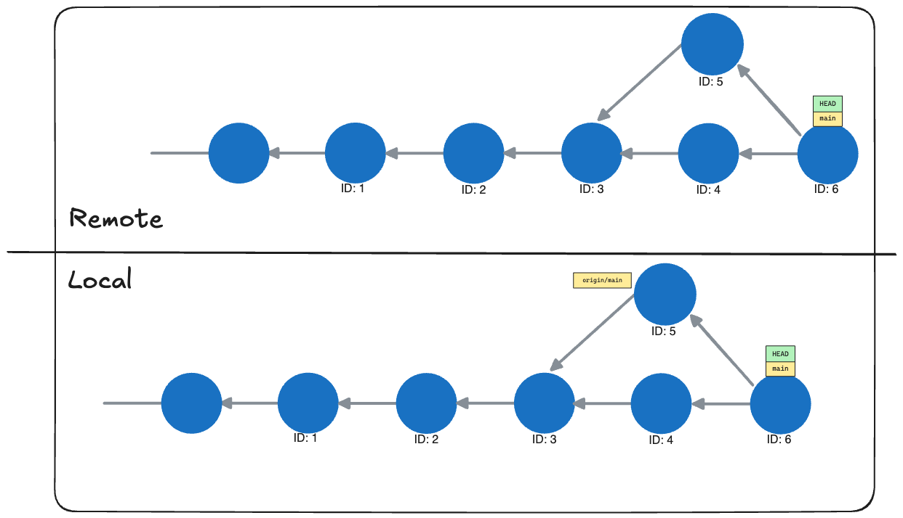

---

[home](../../README.md#) | [current](../../README.md#4-การจัดการและบริหาร-source-code-โดยใช้การแชร์ผ่านเครื่อง-remote-server-ส่วนที่-1) | [next](../../README.md#5-การจัดการและบริหาร-source-code-โดยใช้การแชร์ผ่านเครื่อง-remote-server-ส่วนที่-2)
