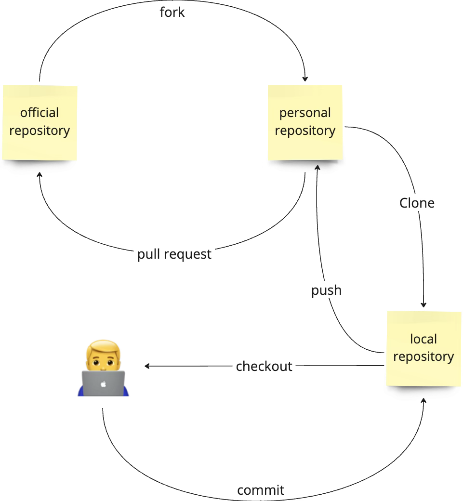

# 5. การจัดการและบริหาร Source Code โดยใช้การแชร์ผ่านเครื่อง Remote Server ส่วนที่ 2

## 1. Good Commit Message Formatting

A typical git commit message will look like

```sh
<type>(<scope>): <subject>
```

1. "type"

   - build: Build related changes (eg: npm related/ adding external dependencies)
   - chore: A code change that external user won't see (eg: change to .gitignore file or .prettierrc file)
   - feat: A new feature
   - fix: A bug fix
   - docs: Documentation related changes
   - refactor: A code that neither fix bug nor adds a feature. (eg: You can use this when there is semantic changes like renaming a variable/ function name)
   - perf: A code that improves performance
   - style: A code that is related to styling
   - test: Adding new test or making changes to existing test

2. "scope" is optional

3. "subject"
   - use imperative, present tense (eg: use "add" instead of "added" or "adds")
   - don't use dot(.) at end
   - don't capitalize first letter

> https://dev.to/ishanmakadia/git-commit-message-convention-that-you-can-follow-1709

## 2. การใช้งาน Pull Request



## 3. ข้อควรระวัง

1. Force Push

   ```sh
   git push -f
   ```

2. Reset Remote Branch

   ```sh
   git reset [--hard, --mixed, --soft]
   git push
   ```

3. Pull Rebase(not frequency sync)

   ```sh
   git pull --rebase
   ```

4. Remove all tag

   ```sh
   git tag | xargs -n1 git tag -d
   ```

## 4. git-stash

1. Show Stash

   ```sh
   git stash list
   ```

2. Stash Uncommit

   ```sh
   git stash
   git stash -m <message>
   ```

3. Unstash

   ```sh
   git stash pop
   git stash pop -n stash@{<index>}
   ```

---

[home](../../README.md#) | [current](../../README.md#5-การจัดการและบริหาร-source-code-โดยใช้การแชร์ผ่านเครื่อง-remote-server-ส่วนที่-2) | [next](../../README.md#6-การบริหารและจัดการ-branch-โดยวิธี-branch-by-environment)
