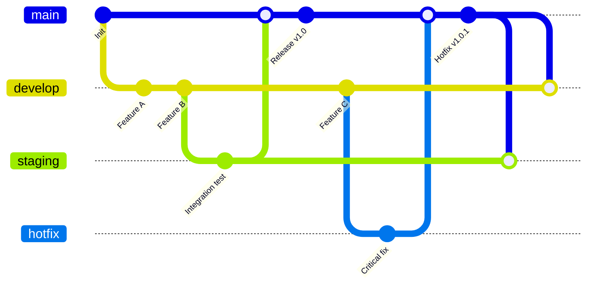

# 6. การบริหารและจัดการ Branch โดยวิธี Branch by Environment

การใช้งาน "Branch by Environment" คือการสร้าง branch แยกตามสภาพแวดล้อมการทำงาน (environment) ของระบบ เช่น development, staging, production

## 1. วิธีคิดและวัตถุประสงค์ของการใช้งานแบบ Branch by Environment

### โครงสร้างพื้นฐาน:

- **main/master** → Production environment
- **staging** → Testing/UAT environment
- **develop** → Development environment
- **feature/** → Individual feature development

## วัตถุประสงค์หลัก (Main Objectives)

### 1. **ควบคุมการ Deploy แต่ละ Environment**

- แต่ละ branch ตรงกับ environment เฉพาะ
- ป้องกันการ deploy โค้ดที่ยังไม่พร้อมไปยัง production
- ง่ายต่อการติดตาม version ในแต่ละ environment

### 2. **การทดสอบแบบเป็นขั้นตอน (Staged Testing)**

- **develop** → ทดสอบ feature ใหม่
- **staging** → ทดสอบการทำงานร่วมกัน (integration testing)
- **main** → เวอร์ชันที่พร้อมใช้งานจริง

### 3. **ลดความเสี่ยงในการ Deploy**

- มีจุดตรวจสอบหลายชั้น
- สามารถ rollback ได้ง่าย
- แยกปัญหาระหว่าง environment

## ข้อดี (Advantages)

### ✅ **ชัดเจนและเข้าใจง่าย**

- Branch name ตรงกับ environment
- ทีมใหม่เข้าใจได้เร็ว
- ลดความสับสนในการ deploy

### ✅ **ควบคุม Release ได้ดี**

- แต่ละ environment มี branch เฉพาะ
- ป้องกันการผิดพลาดในการ deploy
- สามารถ freeze code ใน production ได้

### ✅ **เหมาะกับ Continuous Deployment**

- Auto-deploy เมื่อมี commit ใน branch
- ง่ายต่อการตั้งค่า CI/CD pipeline
- ลดขั้นตอนการ deploy manual

## ข้อเสี่ย (Disadvantages)

### ❌ **Long-lived Branches**

- Branch แต่ละตัวมีอายุยาว
- เสี่ยงต่อ merge conflict
- ยากต่อการ maintain

### ❌ **ไม่เหมาะกับการพัฒนาแบบ Rapid**

- ขั้นตอนการ merge ช้า
- ไม่เหมาะกับ feature ที่เปลี่ยนแปลงบ่อย
- อาจชะลอการ release

### ❌ **Cherry-picking ซับซ้อน**

- ยากในการเลือก commit เฉพาะ
- เสี่ยงต่อการ miss บาง fix
- ต้องจัดการ multiple merges

## 2. Use Cases ที่มีในการใช้ Branch by Environment

## เมื่อไรควรใช้ Branch by Environment

### ✅ **เหมาะกับ:**

- โปรเจกต์ที่มี environment หลายชั้น
- ทีมที่ต้องการควบคุม release อย่างเข้มงวด
- ระบบที่มี deployment pipeline แยกชัด
- โปรเจกต์ที่ต้องการ stability สูง

### ❌ **ไม่เหมาะกับ:**

- การพัฒนาแบบ rapid prototyping
- ทีมเล็กที่ต้องการความเร็ว
- โปรเจกต์ที่เปลี่ยนแปลงบ่อยมาก
- การทำงานแบบ continuous integration แบบเร็ว

---

[home](../../README.md#) | [current](../../README.md#6-การบริหารและจัดการ-branch-โดยวิธี-branch-by-environment) | [next](../../README.md#7-การบริหารและจัดการ-branch-โดยวิธี-trunk-base)
