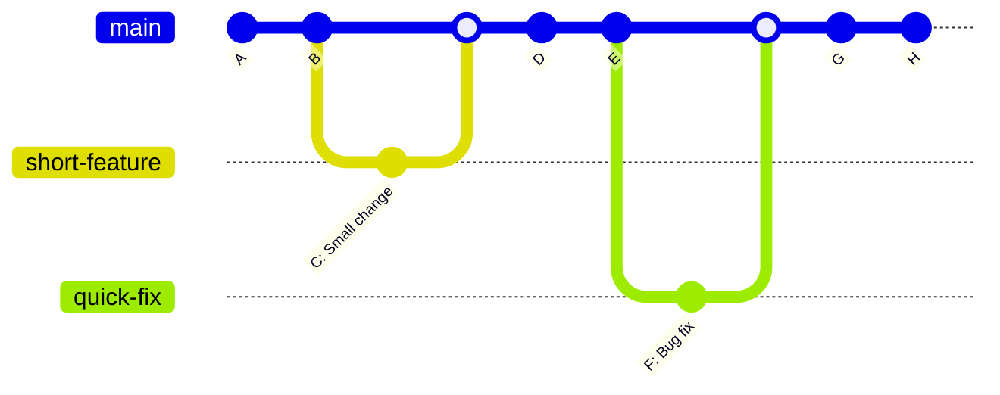
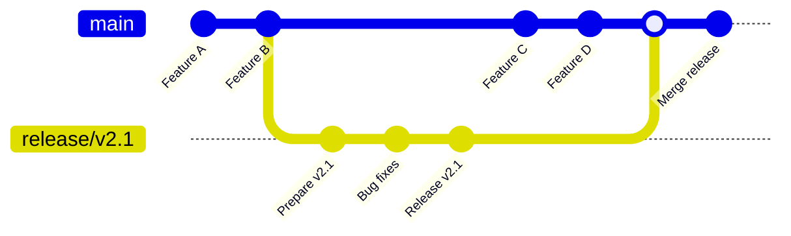
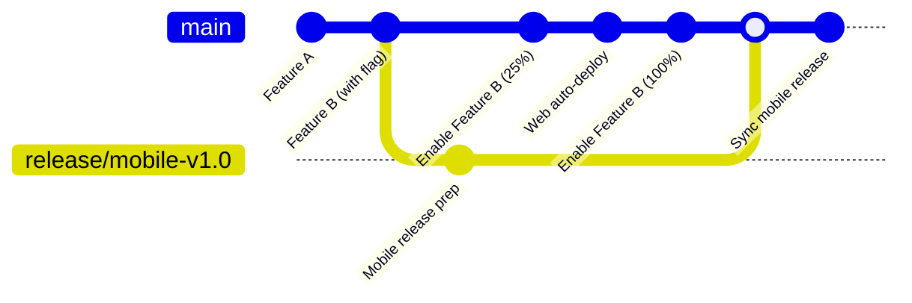

# 7. การบริหารและจัดการ Branch โดยวิธี Trunk Base

การใช้งาน "Trunk-Based Development" คือการพัฒนาโดยให้ทุกคนทำงานบน main branch (trunk) เดียวกัน หรือใช้ short-lived branches ที่อายุสั้นมาก

## 1. วิธีคิดและวัตถุประสงค์ของการใช้งานแบบ Trunk Base

### หลักการพื้นฐาน:

- **ทุกคนทำงานบน main branch** หรือ branch ที่อายุสั้น (< 2 วัน)
- **Commit บ่อยๆ** และเป็นชิ้นเล็กๆ
- **Integration ต่อเนื่อง** ไม่ให้โค้ดแยกออกจากกันนาน
- **Feature Toggle** ใช้แทนการแยก branch



## วัตถุประสงค์หลัง (Main Objectives)

### 1. **ลดความซับซ้อนของการ Merge**

- ไม่มี long-lived branches
- ลด merge conflicts อย่างมาก
- Integration ที่ง่ายและรวดเร็ว

### 2. **เพิ่มความเร็วในการพัฒนา**

- ไม่ต้องรอ branch อื่นเสร็จ
- Feedback loop ที่เร็ว
- ลดเวลาในการ code review

### 3. **ปรับปรุงคุณภาพโค้ด**

- บังคับให้เขียนโค้ดที่แบ่งย่อยได้ดี
- ทดสอบอย่างต่อเนื่อง
- Refactor ง่ายขึ้น

## ข้อดี (Advantages)

### ✅ **ง่ายและเรียบง่าย**

- Git history เป็นเส้นตรง
- ไม่มี branch ซับซ้อน
- เข้าใจได้ง่ายสำหรับนักพัฒนาใหม่

### ✅ **การ Integration ที่ดีกว่า**

- ไม่มี "integration hell"
- ปัญหาถูกค้นพบเร็ว
- ทุกคนเห็นการเปลี่ยนแปลงล่าสุด

### ✅ **เหมาะกับ CI/CD**

- Build และ test อย่างต่อเนื่อง
- Deploy ได้เร็วและบ่อย
- Rollback ง่าย

### ✅ **ลด Overhead**

- ไม่ต้องจัดการหลาย branch
- ไม่ต้อง cherry-pick
- ลดเวลาในการ merge

## ข้อเสีย (Disadvantages)

### ❌ **ต้องมีวินัยสูง**

- ต้อง commit โค้ดที่ใช้งานได้เสมอ
- ต้องเขียน test ที่ดี
- ต้องมี code review ที่เข้มงวด

### ❌ **Feature Toggle ซับซ้อน**

- ต้องจัดการ feature flags
- โค้ดอาจมี conditional logic เยอะ
- ต้องทำความสะอาด toggle เก่า

### ❌ **ไม่เหมาะกับทีมใหญ่หรือ Junior**

- ต้องการทักษะสูงจากนักพัฒนา
- เสี่ยงต่อการ break main branch
- ต้องมี monitoring ที่ดี

## การทำงานแบบ Trunk-Based

### 1. **Direct Commit to Main** (ทีมเล็ก/เชี่ยวชาญ)

```bash
# ทำงานโดยตรงบน main
git checkout main
git pull
# เขียนโค้ด commit เล็กๆ บ่อยๆ
git add .
git commit -m "Add small feature increment"
git push
```

### 2. **Short-lived Feature Branches** (ทีมใหญ่)

```bash
# สร้าง branch อายุสั้น
git checkout -b feature-123
# ทำงาน 1-2 วัน
git commit -m "Implement feature"
# Merge กลับเร็วๆ
git checkout main
git merge feature-123
git branch -d feature-123
```

### 3. **Feature Toggle Pattern**

```javascript
// ใช้ feature flag แทน branch
function newFeature() {
  if (featureFlag.isEnabled('NEW_SEARCH')) {
    return enhancedSearch();
  }
  return legacySearch();
}
```

## เมื่อไรควรใช้ Trunk-Based Development

### ✅ **เหมาะกับ:**

- ทีมที่มีประสบการณ์สูง
- โปรเจกต์ที่ต้องการ deployment บ่อย
- การพัฒนาแบบ microservices
- ทีมที่มี automated testing ดี
- องค์กรที่ต้องการ DevOps วัฒนธรรม

### ❌ **ไม่เหมาะกับ:**

- ทีมใหม่หรือ junior developers เยอะ
- โปรเจกต์ที่ต้องการ release planning เข้มงวด
- ระบบที่ไม่สามารถ rollback ได้ง่าย
- การพัฒนาที่ต้องการ feature isolation นาน

## การเตรียมความพร้อม

### Technical Requirements:

- **Automated Testing**: Unit, Integration, E2E tests
- **CI/CD Pipeline**: Build, test, deploy อัตโนมัติ
- **Feature Flags**: ระบบจัดการ feature toggles
- **Monitoring**: ตรวจสอบ production อย่างต่อเนื่อง

### Team Requirements:

- **Code Review**: การ review ที่รวดเร็วและมีคุณภาพ
- **Communication**: การสื่อสารที่ดีในทีม
- **Discipline**: วินัยในการ commit โค้ดที่ดี
- **Skills**: ทักษะในการเขียนโค้ดแบ่งย่อยได้ดี

---

## 2. Use Cases ที่มีในการใช้ Trunk Base

การใช้ Trunk-Based Development มีหลายรูปแบบในการจัดการ release ขึ้นอยู่กับความต้องการและข้อจำกัดของโปรเจกต์

## 1. Branch by Abstraction

### แนวคิด (Concept)

ใช้ abstraction layer เพื่อแทนที่ branch แยกเมื่อต้องการเปลี่ยนแปลงใหญ่

### Use Cases:

#### 🔄 **การ Refactor ระบบใหญ่**

```javascript
// ระยะที่ 1: สร้าง abstraction
class PaymentService {
  process(payment) {
    if (config.useNewPaymentSystem) {
      return this.newPaymentProcessor.process(payment);
    }
    return this.legacyPaymentProcessor.process(payment);
  }
}

// ระยะที่ 2: พัฒนาระบบใหม่ค่อยๆ
// ระยะที่ 3: เปิดใช้ระบบใหม่ทีละส่วน
// ระยะที่ 4: ลบระบบเก่าออก
```

#### 🏗️ **การเปลี่ยน Database/Infrastructure**

```python
# Migration จาก MySQL เป็น PostgreSQL
class UserRepository:
    def __init__(self):
        self.use_new_db = FeatureFlag.is_enabled('NEW_DATABASE')

    def find_user(self, user_id):
        if self.use_new_db:
            return PostgreSQLUserRepo().find(user_id)
        return MySQLUserRepo().find(user_id)
```

#### 🎨 **การ Redesign UI/UX ใหม่**

```jsx
function ProductPage({ productId }) {
  const showNewDesign = useFeatureFlag('NEW_PRODUCT_PAGE');

  return showNewDesign ? (
    <NewProductPageDesign productId={productId} />
  ) : (
    <LegacyProductPageDesign productId={productId} />
  );
}
```

### ข้อดี:

- ✅ ไม่ต้องแยก branch นาน
- ✅ สามารถ test ทั้งสองระบบได้
- ✅ Rollback ได้ทันที
- ✅ การเปลี่ยนแปลงแบบค่อยเป็นค่อยไป

### ข้อเสีย:

- ❌ โค้ดซับซ้อนขึ้นชั่วคราว
- ❌ ต้องจัดการ feature flags
- ❌ ต้องทำความสะอาด abstraction

---

## 2. Branch for Release

### แนวคิด (Concept)

สร้าง release branch เฉพาะเมื่อต้องการ release แต่ยังคงพัฒนาต่อใน main

### Use Cases:

#### 📦 **การ Release แบบ Schedule**



#### 🚀 **การ Release บน Mobile App Stores**

```bash
# สร้าง release branch สำหรับ App Store review
git checkout -b release/ios-v1.2.0
# ปรับแต่ง version, certificates
git commit -m "Prepare iOS release v1.2.0"
# Submit to App Store

# ขณะเดียวกัน main ยังพัฒนาต่อ
git checkout main
git commit -m "Add new feature for next version"
```

#### 🏢 **การ Release แบบ Enterprise**

```yaml
# CI/CD Pipeline สำหรับ Enterprise
release-pipeline:
  triggers:
    - branch: release/*
  steps:
    - security-scan
    - compliance-check
    - staging-deployment
    - manual-approval
    - production-deployment
```

### ข้อดี:

- ✅ ควบคุม release ได้เข้มงวด
- ✅ สามารถแก้ไข release-specific issues
- ✅ Main branch ไม่ถูกรบกวน
- ✅ เหมาะกับ compliance requirements

### ข้อเสีย:

- ❌ ต้องจัดการหลาย branches
- ❌ อาจมี merge conflicts
- ❌ Cherry-picking ซับซ้อน

---

## 3. Release from Trunk

### แนวคิด (Concept)

Release โดยตรงจาก main branch ผ่าน CI/CD pipeline

### Use Cases:

#### ⚡ **Continuous Deployment**

```yaml
# GitHub Actions example
name: CD Pipeline
on:
  push:
    branches: [main]

jobs:
  deploy:
    runs-on: ubuntu-latest
    steps:
      - uses: actions/checkout@v2
      - name: Run tests
        run: npm test
      - name: Deploy to production
        if: github.ref == 'refs/heads/main'
        run: ./deploy.sh
```

#### 🌐 **SaaS Applications**

```javascript
// Canary deployment strategy
const deploymentConfig = {
  strategy: 'canary',
  canaryPercentage: 5, // เริ่มที่ 5% ของ users
  successCriteria: {
    errorRate: '<1%',
    responseTime: '<500ms',
  },
  rollbackOnFailure: true,
};
```

#### 🔄 **API Services**

```python
# Blue-Green deployment
@app.route('/health')
def health_check():
    return {
        'status': 'healthy',
        'version': os.environ.get('APP_VERSION'),
        'deployment': os.environ.get('DEPLOYMENT_COLOR')
    }

# Feature flags สำหรับ API endpoints
@feature_flag('NEW_USER_API')
def get_user_v2():
    return enhanced_user_service.get_user()
```

#### 📱 **Web Applications**

```javascript
// Progressive rollout
const rolloutConfig = {
  'new-checkout-flow': {
    percentage: featureRollout.getPercentage('new-checkout'),
    criteria: {
      userType: ['premium', 'beta'],
      region: ['US', 'EU'],
    },
  },
};
```

### ข้อดี:

- ✅ การ deployment เร็วที่สุด
- ✅ Feedback loop สั้น
- ✅ ไม่มี branch overhead
- ✅ True continuous delivery

### ข้อเสีย:

- ❌ ต้องมี automated testing ที่แข็งแกร่ง
- ❌ ต้องมี monitoring และ alerting ดี
- ❌ ทุก commit ต้องพร้อม production

---

## การเลือกใช้ Strategy

### 🎯 **Branch by Abstraction**

**เมื่อไร:** การเปลี่ยนแปลงใหญ่ที่ใช้เวลานาน

```
✅ Refactor architecture ใหญ่
✅ Migration database/infrastructure
✅ การเปลี่ยน third-party services
✅ Breaking changes ที่ใหญ่
```

### 🏷️ **Branch for Release**

**เมื่อไร:** ต้องการควบคุม release process

```
✅ Mobile app releases (App Store review)
✅ Enterprise software (compliance)
✅ Scheduled releases (quarterly/monthly)
✅ Multi-environment deployments
```

### 🚀 **Release from Trunk**

**เมื่อไร:** ต้องการความเร็วและ flexibility

```
✅ SaaS applications
✅ Web services/APIs
✅ Internal tools
✅ Startup/agile environments
```

## Hybrid Approaches

### 🔄 **ผสมผสานหลาย Strategies**



### การใช้งานจริง:

- **Web**: Release from trunk ด้วย feature flags
- **Mobile**: Branch for release เนื่องจาก App Store review
- **Infrastructure**: Branch by abstraction สำหรับการ migrate ใหญ่

---

[home](../../README.md#) | [current](../../README.md#7-การบริหารและจัดการ-branch-โดยวิธี-trunk-base) | [next](../../README.md#8-การจัดการ-version-ของ-application)
